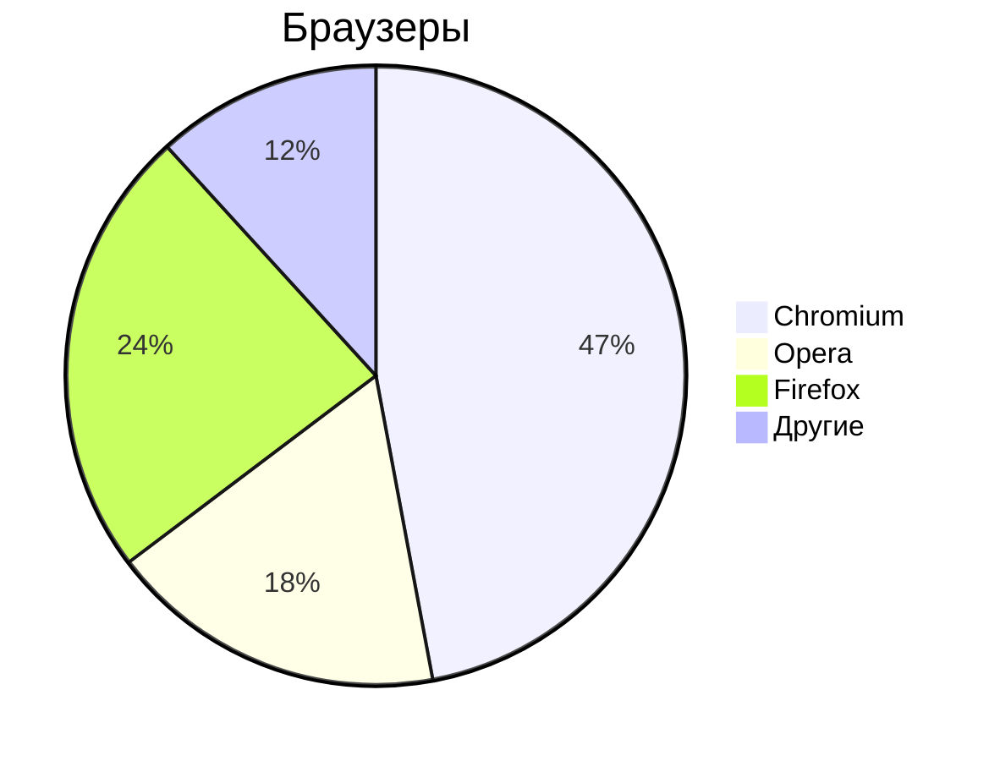

# Markdown
 
**Markdown** - простое форматирование документа, пригодное для Git-репозиториев, документации и заметок.
 
## Основы редактирования текста
 
### Курсор
 
Клавиши
 
- `Home` - курсор в начало строки
- `END`  - курсор в конец строки
- `PgUp` - курсор вверх видимой части документа
- `PgDn` - курсор вниз видимой части документа
 
### Выделение текста
 
- `Ctrl+A` - выделить весь текст
- `Ctrl+>` - выделить символ справа от курсора
- `Ctrl+<` - выделить символ слева от курсора
- `Ctrl+S` - сохранить документ
- `Ctrl+C` - копировать
- `Ctrl+V` - вставить
- `Shift+>` - посимвольное выделение вправо
- `Shift+<` - посимвольное выделение влево
- `Ctrl+Shift+>` - пословное выделение текста справо
- `Ctrl+Shift+<` - пословное выделение текста влево
 
### Копирование/вставка
 
- `Ctrl+Shift+C` - копировать выделенное в терминале
- `Ctrl+Shift+V` - вставить выделенное в терминале
 
### Редактирование текста
- `Del` - удалить символ справа от курсора
- `BackSpace` - удалить символ слева от курсора
- `Ins/Insert` - замещение старого текста новым справа от курсора
- `Ctrl+>` - перемещение по словам вправо
- `Ctrl+<` - перемещение по словам влево
 
---
 
## Markdown
 
Загаловки
 
# - Заголовок 1-го уровня
## - Заголовок 2-го уровня
### - Заголовок 3-го уровня
#### - Заголовок 4-го уровня
<u> - Подчёркнутый текст </u>
 
Текст
 
- **Жирный текст**
- *Курсив*
- ~~Зачёркнутый текст~~
 
--
 
Списки
 
Ненумерованный
 
- Пункт 1
- Пункт 2
- Пункт 3
    - Пункт 3_1
    - Пункт 3_2
 
* Пункт 1
* Пункт 2
* Пункт 3
    * Пункт 3_1
    * Пункт 3_2
 
Нумерованный список
 
1. Пункт 1
1. Пункт 2
1. Пункт 3
    1. Пункт 3_1
    1. Пункт 3_2
 
***
 
Горизонтальная черта
 
---
 
***
 
Ссылки
 
Внутренние ссылки
 
[Текст ссылки](/README.md)
 
Якоря по документу
 
- [Редактирование](#text-editor)
 
Внешние ссылки
 
- [ОЗОН](https://ozon.ru)
 
Изображения
 

 
Код
 
`Ctrl+R` - обновить страницу браузера
`F5`     - обновить страницу браузера
 
```python
print('Hello!');
```
```cpp
int main() {
    pust("Hello");
}
```

 
Цитаты
 
> Тут важный текст
> Цитата 1
> Цитата 2
 
Таблицы
 
| Заголовок 1 | Заголовок 2 | Заголовок 3 |
|-------------|-------------|-------------|
| Ячейка 1    | Ячейка 2    | Ячейка 3    |
| Ячейка 4    | Ячейка 5    | Ячейка 6    |